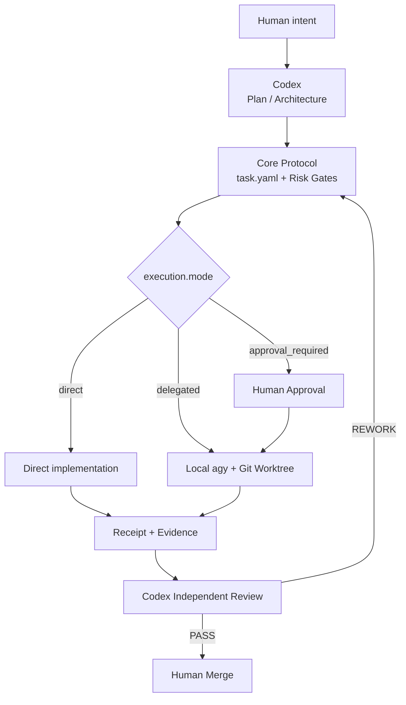

# gpt-antigravity-dev-control

[中文说明](README.zh-CN.md)

A local-first AI development control plane: **Codex plans and reviews;
Antigravity / Gemini implements bounded tasks in Git worktrees; humans approve
high-risk work and merge**.

There is one task protocol and one primary CLI. Per-task `execution.mode` selects
direct implementation, local delegation, or approval-required delegation.

The primary deliverable is `.agents/skills/antigravity-delegate`. Copy that Skill into
another Git project and initialize only its minimal `.ai/` runtime state:

```powershell
python .agents/skills/antigravity-delegate/scripts/control.py init --repo D:\Projects\my-app
python .agents/skills/antigravity-delegate/scripts/control.py --repo D:\Projects\my-app create TASK-001 --title "Bounded change" --objective "Observable result"
```

## Quick start

```sh
python -m pip install -r .agents/skills/antigravity-delegate/scripts/requirements-local.txt
python .agents/skills/antigravity-delegate/scripts/control.py status
python .agents/skills/antigravity-delegate/scripts/control.py probe
python .agents/skills/antigravity-delegate/scripts/control.py --help
```

Create a task from `.agents/skills/antigravity-delegate/templates/task/`, then choose its route:

```yaml
execution:
  mode: delegated  # direct | delegated | approval_required
  adapter: antigravity_cli
  context_budget: compact
  report_level: summary
  max_execution_attempts: 2
  escalation: codex_review
```

```sh
python .agents/skills/antigravity-delegate/scripts/control.py validate TASK-001
python .agents/skills/antigravity-delegate/scripts/control.py route TASK-001
python .agents/skills/antigravity-delegate/scripts/control.py prepare TASK-001 --approve
python .agents/skills/antigravity-delegate/scripts/control.py launch TASK-001 --approve --interactive
python .agents/skills/antigravity-delegate/scripts/control.py collect TASK-001
```

The older ai.py and delegate.py commands remain compatibility entry points;
new usage should use control.py.

## Use it inside Codex

The project Plus profile uses Luna max for the root, Luna medium for native
execution roles and Astra low for independent review. Root chooses native workers
or local Antigravity under the same contract and risk gates. Native threads are
capped at two; the combined native/agy budget is root-coordinated, not a shared
runtime lock. See [Hybrid Orchestration](.agents/skills/antigravity-delegate/references/orchestration.md).

With Python 3.11+, run `python .agents/skills/antigravity-delegate/scripts/control.py check-orchestration` to detect
project configuration drift. This is not runtime model or sandbox verification.

The repository includes a discoverable skill at
.agents/skills/antigravity-delegate. In a Codex task opened on this checkout,
invoke $antigravity-delegate. Codex then owns the planning, command execution,
receipt collection, review, and recovery flow; agy is started only as the local
implementation subprocess.

Codex may select the Skill automatically for bounded multi-file work. Multi-agent
runs use a dependency DAG, two concurrent agents by default, up to four for
large read-only workloads after a healthy ramp-up, separate Worktrees for
independent writers, one bounded retry with serial fallback, and a compact
`summary.json`/`handoff.md` review handoff.


## Flow



## Execution modes

| Mode | Use when | Execution |
|---|---|---|
| `direct` | Root/manual work or bounded native Codex tasks | Root, human or native worker implements; root checks evidence |
| `delegated` | Bounded multi-file implementation, tests, or refactors | Local agy implements in an isolated worktree |
| `approval_required` | Architecture, security, migration, deployment, destructive, or other high-risk work | Approval artifact first, then local delegation |

All modes share the same state machine, receipts, evidence rules, review gate,
and human merge authority. See [Execution Modes](.agents/skills/antigravity-delegate/references/orchestration.md).

## Full-access launch

For a disposable trusted worktree only:

```sh
python .agents/skills/antigravity-delegate/scripts/control.py launch TASK-001 --approve --interactive --full-access
```

This explicitly passes agy's `--dangerously-skip-permissions`; it does not grant
administrator rights or disable scope, receipt, review, and merge gates.

## Core guarantees

- `.ai/` and Git are durable project truth.
- `task.yaml` defines scope, authority, risk, routing, and acceptance criteria.
- Executor `COMPLETE` is not reviewer `PASS`.
- Delegated and medium/high-risk implementation uses isolated Git worktrees.
- Missing evidence fails closed; REWORK preserves earlier attempt evidence.
- Full logs remain local and compact receipts are reviewed first.
- The controller never automatically merges or declares a task DONE.

## Documentation

### Usage

- [Quick Start](.agents/skills/antigravity-delegate/references/workflow.md)
- [Control Workflow](.agents/skills/antigravity-delegate/references/workflow.md)
- [Local Delegation Operations](.agents/skills/antigravity-delegate/references/delegation.md)

### Technical reference

- [Documentation map](.agents/skills/antigravity-delegate/SKILL.md)
- [Execution Modes](.agents/skills/antigravity-delegate/references/orchestration.md)
- [Architecture](.agents/skills/antigravity-delegate/references/workflow.md)
- [Current Limitations](.agents/skills/antigravity-delegate/references/delegation.md)
- [Cost Measurement](COST_METRICS.md)
- [Risk Gates](.agents/skills/antigravity-delegate/references/workflow.md)

## Status

Current version: **3.2.0-local**. The project is a local control workflow; no
remote scheduler, reviewer API, or fixed token-savings claim is required.

## License

MIT. See [LICENSE](LICENSE).
