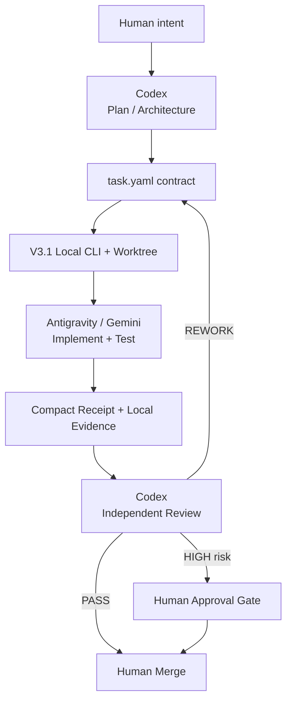

# gpt-antigravity-dev-control

[中文说明](README.zh-CN.md)

Repository-native AI development control plane for pairing **Codex** as planner
and reviewer with **Antigravity / Gemini** as a bounded local implementation
executor.

## V3.1: local-first delegation

Codex plans and accepts; local `agy` implements in an isolated Git worktree.
Compact receipts return first while full logs remain local. No remote reviewer
API, automatic merge, background scheduler, or remote concurrency service is
required.

```sh
python -m pip install -r .ai/scripts/requirements-local.txt
python .ai/scripts/delegate.py probe
python .ai/scripts/delegate.py --help
```

Use the repo-scoped `$antigravity-delegate` skill and follow the
[V3.1 guide](docs/LOCAL_DELEGATION.md). Small changes can stay direct; bounded
multi-file implementation and tests are suitable for delegation.

For a disposable trusted worktree,
`launch --interactive --full-access --approve` passes agy's
`--dangerously-skip-permissions`. It is explicit, never the default, and does
not grant Windows administrator rights. Receipt, scope, review, and merge gates
remain active.


## Flow



## Operating modes

| Mode | Branch | Best for | Flow |
|---|---|---|---|
| V3.1 Local | `main` | local-first bounded implementation with explicit confirmation | Codex → local agy/worktree → compact receipt → Codex |
| V2 Manual | `v2` | minimal moving parts and fully manual dispatch | Codex → task → Antigravity → review |

The former V3 Lite remote/API implementation is preserved on
[`archive/v3-lite`](https://github.com/zhttttttty/gpt-antigravity-dev-control/tree/archive/v3-lite)
and intentionally absent from `main`.

## Manual V2-compatible commands

```bash
python .ai/scripts/ai.py status
python .ai/scripts/ai.py validate TASK-001
python .ai/scripts/ai.py start TASK-001 --worktree
```

## Core guarantees

- `.ai/` and Git are the durable project control plane.
- `task.yaml` defines scope, authority, risk, and acceptance criteria.
- Executor `COMPLETE` is not reviewer `PASS`.
- Medium/high-risk implementation uses isolated Git worktrees.
- High-risk work cannot reach DONE without required gates and human approval.
- REWORK preserves prior attempt evidence under `history/attempt-N/`.
- Local runtime logs are evidence, not an authoritative second task queue.

## Documentation

- [Quick Start](docs/QUICK_START.md)
- [V3.1 Local Delegation](docs/LOCAL_DELEGATION.md)
- [Architecture](docs/ARCHITECTURE.md)
- [V2 vs V3.1](docs/V2_V3_1_COMPARISON.md)
- [Current limitations](docs/LIMITATIONS.md)
- [Cost measurement](COST_METRICS.md)
- [Risk Gates](.ai/rules/RISK_GATES.md)
- [Example task](examples/minimal-task/README.md)

## Status

Current line: **V3.1 / 3.1.1-local**. V3.1 local delegation is the sole primary
path on `main`; V3 Lite is archive-only. No fixed token-savings percentage is
promised—measure actual task time, retries, and model usage.

## License

MIT. See [LICENSE](LICENSE).
