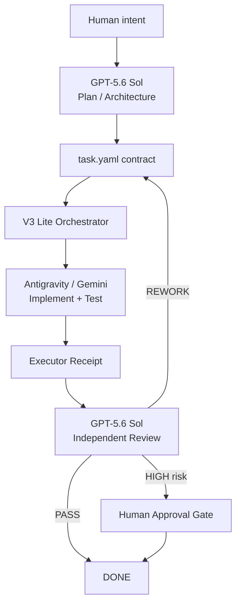

# gpt-antigravity-dev-control

[中文说明](README.zh-CN.md)

Repository-native AI development control plane for pairing **GPT-5.6 Sol** as PM / Architect / Planner / Reviewer with **Antigravity / Gemini** as a bounded implementation executor.


## Why

The project separates **planning**, **execution**, **evidence**, and **review** so an implementation agent cannot silently redefine its own task or declare itself successful.



## Two operating modes

| Mode | Branch | Best for | Flow |
|---|---|---|---|
| V2 Manual | `v2` | small projects, 5–20 tasks, transparent manual control | GPT → task → Antigravity → review |
| V3 Lite | `main` | long-running projects, repeated review loops, automation experiments | GPT → Orchestrator → Antigravity → GPT review |

V3 Lite **does not replace V2**. It automates the same task contracts, receipts, risk gates and Git worktree rules.

## Quick start

```bash
git clone https://github.com/zhttttttty/gpt-antigravity-dev-control.git
cd gpt-antigravity-dev-control
python -m pip install -r .ai/orchestrator/requirements.txt
python .ai/orchestrator/orchestrator.py init
python .ai/orchestrator/orchestrator.py status
```

For real V3 execution, set `OPENAI_API_KEY` and `GEMINI_API_KEY`. Private repositories also need `ANTIGRAVITY_GITHUB_PAT`.

Run queued work:

```bash
python .ai/orchestrator/orchestrator.py loop --until-idle
```

For manual V2 usage:

```bash
python .ai/scripts/ai.py status
python .ai/scripts/ai.py validate TASK-001
python .ai/scripts/ai.py start TASK-001 --worktree
```

## Core guarantees

- `.ai/` is the canonical project control plane.
- `task.yaml` defines scope, authority, risk and acceptance criteria.
- Executor `COMPLETE` is not reviewer `PASS`.
- Medium/high-risk implementation uses isolated Git worktrees.
- High-risk work cannot reach DONE without required gates and human approval.
- REWORK preserves prior attempt evidence under `history/attempt-N/`.
- SQLite in V3 Lite is coordination state; Git + task artifacts remain durable truth.

## Documentation

- [Quick Start](docs/QUICK_START.md)
- [Architecture](docs/ARCHITECTURE.md)
- [V2 vs V3 Lite](docs/V2_V3_COMPARISON.md)
- [Current limitations](docs/LIMITATIONS.md)
- [AI workflow details](README_AI_WORKFLOW.md)
- [V3 Orchestrator](.ai/orchestrator/README.md)
- [Risk Gates](.ai/rules/RISK_GATES.md)
- [Example task](examples/minimal-task/README.md)

## Status

Current line: **V3 Lite / 3.0.0-lite**. The repository is intentionally lightweight: no Redis, Kubernetes, message broker or web dashboard is required.

The V2 protocol is the stable conceptual core; V3 Lite should be treated as an evolving reference automation layer. Provider model/API names can change over time, so verify `.ai/orchestrator/config.yaml` before real execution.

## License

MIT. See [LICENSE](LICENSE).
