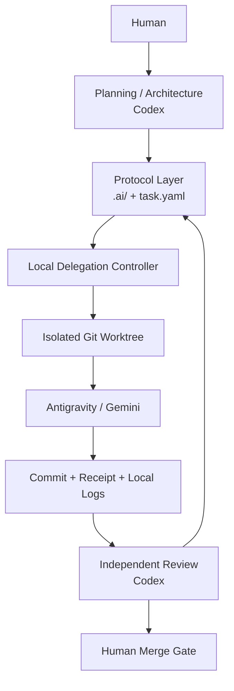

# Architecture

## Unified local-first path

Codex skill → `.ai/scripts/control.py` → Core Protocol or local agy adapter →
isolated Git worktree → compact receipt → independent Codex review → human merge.
All execution modes share one state machine. The controller does not call a remote reviewer,
run a background scheduler, or maintain a second task database.

## Durable protocol layer

- project requirements and architecture;
- structured task contracts and folder-backed states;
- Risk Gates and Executor/QA Receipts;
- ADRs, Git history, commits, and worktrees;
- attempt history for REWORK.

This is the compatibility boundary. Executor adapters can change without
redefining task semantics.

## Repository layout

| Path | Responsibility |
|---|---|
| .ai/config.yaml | state machine, role authority, risk gates, isolation, and review policy |
| .ai/tasks/ | queue, active, review, blocked, done, and archived task folders |
| .ai/templates/task/ | task, brief, context, receipt, review, and rollback templates |
| .ai/scripts/control.py | public command entry point and command routing |
| .ai/scripts/ai.py | task validation, state transitions, and worktree helpers |
| .ai/scripts/delegate.py | local agy preparation, launch, diagnostics, and evidence collection |
| .ai/adapters/ | replaceable executor interface and agy argument adapter |
| .ai/runtime/ | ignored locks, run records, context packs, logs, and compact receipts |
| .agents/skills/ | repository-discoverable Codex skill and protocol references |

## Task lifecycle

The state folders form a fail-closed state machine:

    queue/READY
       ├── start/prepare ──> active/IN_PROGRESS
       │                         ├── collect ──> review/REVIEW
       │                         └── failure ──> blocked/BLOCKED
       ├── validation failure ─> blocked/BLOCKED
       └── completed review ───> done/DONE ──> archive/ARCHIVED

The task contract is immutable during an execution attempt. A contract digest
binds approval files, context packs, receipts, and collection checks to the same
planned scope. Runtime records are disposable; task folders and Git history are
the recovery source.

## Data and control boundaries

1. The planner writes a task contract and acceptance checks.
2. The controller validates the contract and creates a worktree when required.
3. The executor writes implementation files and an executor receipt in that
   worktree.
4. The controller observes ancestry, scope, receipt identity, reported checks,
   and acceptance evidence.
5. The reviewer inspects the compact result and selected diff independently.
6. Human approval is required for configured high-risk gates and final merge.

The controller never sends a remote review request, treats executor claims as
independent proof, or upgrades COMPLETE directly to DONE.

## Local delegation layer

- explicit route, prepare, launch, status, diagnose, recover, and collect steps;
- one isolated worktree and branch per attempt;
- compact context packs with a hard size limit;
- full local logs plus summary-first receipts;
- fail-closed scope and evidence checks;
- no automatic merge, retry loop, or parallel remote scheduler.

Local runtime records are recoverable evidence, not durable project truth. If a
runtime record disagrees with committed task artifacts or Git history, reconcile
toward the repository artifacts after inspection.

## Authority boundaries

Codex owns architecture, planning, and independent acceptance. Antigravity owns
bounded implementation and evidence generation. Humans retain high-risk approval
and final integration authority.

## Failure model

Missing or ambiguous evidence becomes `UNKNOWN`, `NOT_RUN`, `NEEDS_ATTENTION`,
or `BLOCKED`, never an inferred PASS. See
[local operations](LOCAL_DELEGATION.md) and
[ADR-001](../.ai/decisions/ADR-001-local-delegation.md).
