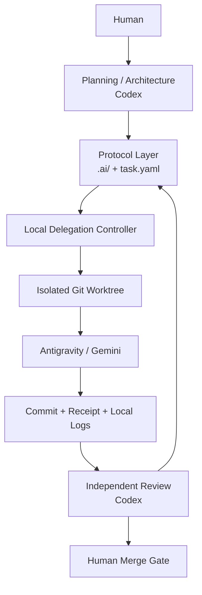

# Architecture

## Unified local-first path

Codex skill → `.ai/scripts/control.py` → Core Protocol or local agy adapter →
isolated Git worktree → compact receipt → independent Codex review → human merge.
All execution modes share one state machine. The controller does not call a remote reviewer,
run a background scheduler, or maintain a second task database.

## Durable protocol layer

- project requirements and architecture;
- structured task contracts and folder-backed states;
- Risk Gates and Executor/QA Receipts;
- ADRs, Git history, commits, and worktrees;
- attempt history for REWORK.

This is the compatibility boundary. Executor adapters can change without
redefining task semantics.

## Local delegation layer

- explicit route, prepare, launch, status, diagnose, recover, and collect steps;
- one isolated worktree and branch per attempt;
- compact context packs with a hard size limit;
- full local logs plus summary-first receipts;
- fail-closed scope and evidence checks;
- no automatic merge, retry loop, or parallel remote scheduler.

Local runtime records are recoverable evidence, not durable project truth. If a
runtime record disagrees with committed task artifacts or Git history, reconcile
toward the repository artifacts after inspection.

## Authority boundaries

Codex owns architecture, planning, and independent acceptance. Antigravity owns
bounded implementation and evidence generation. Humans retain high-risk approval
and final integration authority.

## Failure model

Missing or ambiguous evidence becomes `UNKNOWN`, `NOT_RUN`, `NEEDS_ATTENTION`,
or `BLOCKED`, never an inferred PASS. See
[local operations](LOCAL_DELEGATION.md) and
[ADR-001](../.ai/decisions/ADR-001-local-delegation.md).
