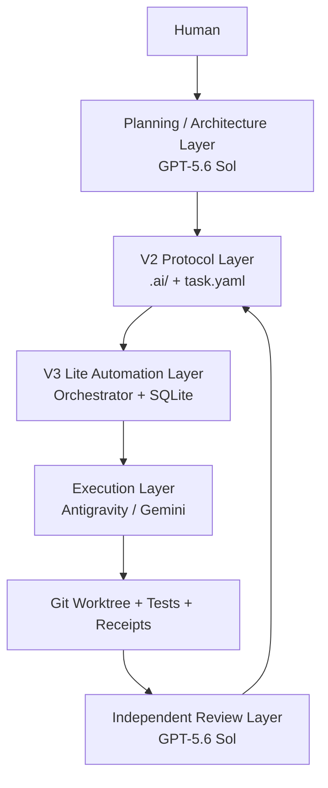

# Architecture

## Preferred V3.1 local path

Codex skill → `.ai/scripts/delegate.py` → executor interface / local agy →
isolated Git worktree → compact receipt → independent Codex review → human merge.
The controller uses the existing V2 state machine, with no remote reviewer call.
Runtime logs are local evidence, not a second authoritative task queue.
See [ADR-001](../.ai/decisions/ADR-001-local-delegation.md) and
[local operations](LOCAL_DELEGATION.md). The older automation layer below remains optional.

## Layers

## V2 Protocol Layer

Durable, repository-native artifacts:

- project requirements and architecture;
- structured task contract;
- task state folders;
- Risk Gates;
- Executor/QA Receipts;
- ADRs;
- Git history and worktrees.

This is the compatibility boundary. An alternative Orchestrator can be written without redefining the task protocol.

## V3 Lite Automation Layer

V3 Lite adds coordination only:

- SQLite runtime table;
- dispatch state;
- attempt tracking;
- lease/worker metadata;
- provider IDs;
- automated review loop.

SQLite is not the source of project truth. If runtime state and repository artifacts disagree, reconcile toward the repository artifacts.

## Authority boundaries

GPT-5.6 Sol owns architecture, planning and independent acceptance. Antigravity owns bounded implementation and evidence generation. Human authority remains mandatory for architecture/high-risk approval where configured.

## Failure model

The system is designed to fail closed: missing evidence becomes `UNKNOWN`, `NOT_RUN` or `BLOCKED`, not an inferred PASS.
