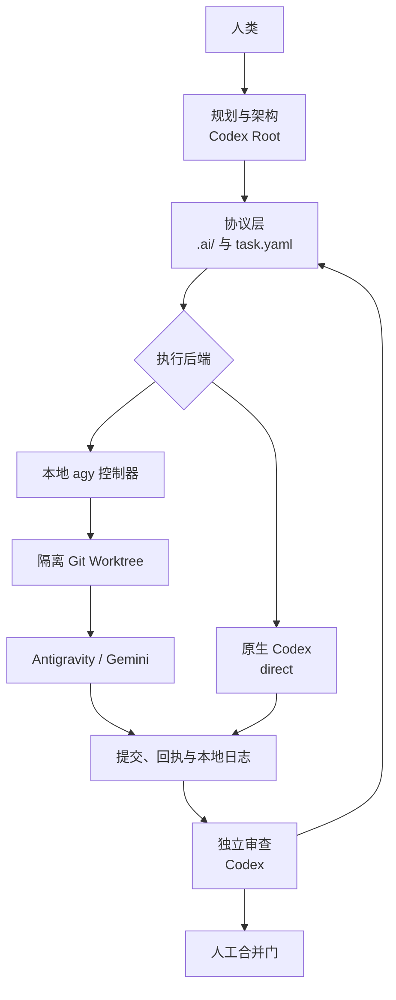

# 架构

## 本地控制路径

Codex Root/Skill 根据 `.ai/` 契约选择原生 Codex 或本地 agy。control.py 管理任务
协议和 agy 生命周期；Root 管理原生派发与证据检查。两条路径都交付回执，经过独立
Review 和人工合并。模型偏好与路由见 [混合执行](HYBRID_ORCHESTRATION.md)。

所有执行模式共用同一状态机。控制器不调用远程 Reviewer、不运行后台调度器，
也不维护第二套任务数据库。

## 持久化协议层

- 项目需求、架构和 ADR；
- 结构化任务契约和状态目录；
- Risk Gate、Executor/QA Receipt；
- Git 历史、提交和 Worktree；
- REWORK 的尝试历史。

这是兼容边界，Executor Adapter 可以替换而不改变任务语义。

## 数据与控制边界

1. 规划者建立契约和验收检查。
2. 控制器验证契约，并在需要时创建 Worktree。
3. 执行者在 Worktree 修改实现并写执行回执。
4. agy 路径由 collect 观察祖先关系、范围、回执身份和声明证据；原生路径由 Root 显式检查。
5. 审查者独立检查精简结果、选定 Diff 和证据。
6. 配置的高风险门和最终合并由人类批准。

控制器不会把执行声明视为独立证明，也不会将 COMPLETE 直接升级为 DONE。

## 仓库目录

| 路径 | 职责 |
|---|---|
| .ai/config.yaml | 状态机、角色权限、Risk Gate、隔离和 Review 策略 |
| .ai/tasks/ | queue、active、review、blocked、done、archive |
| .ai/templates/task/ | 任务、上下文、回执、Review 和回滚模板 |
| .ai/scripts/control.py | 公开命令入口和路由 |
| .ai/scripts/ai.py | 校验、状态迁移和 Worktree 辅助 |
| .ai/scripts/delegate.py | agy 准备、启动、诊断和证据收集 |
| .ai/adapters/ | Executor 接口和 agy 参数 Adapter |
| .ai/runtime/ | 被忽略的锁、运行记录、日志和精简回执 |
| .codex/ | 项目模型默认值与原生角色边界 |
| .agents/skills/ | 仓库 Skill、协议引用与 agy 脚本 |
| .ai/scripts/check_orchestration.py | 离线配置一致性检查，不负责原生调度 |

## 状态生命周期

    READY -> IN_PROGRESS -> REVIEW -> DONE -> ARCHIVED
    READY / IN_PROGRESS / REVIEW -> BLOCKED -> READY
    REVIEW -> READY (REWORK)

校验失败会停止当前操作，不代表必然迁入 BLOCKED。本地 collect 按证据检查结果
执行迁移；原生任务的证据检查和状态迁移由 Root 显式处理。

执行期间契约不能被执行者擅自修改。本地委派用契约摘要绑定审批、上下文和收集
检查；原生证据由 Root 核验。恢复或验收仍需要的运行记录必须保留，被 Git 忽略
不等于可以删除。任务目录与 Git 保存持久状态，引用的日志和运行记录补充证据。

## 权限边界

Root 负责架构、规划和协调独立验收；原生 worker 与 Antigravity 负责受限实现和
证据；只读 Reviewer 返回结果，由 Root 记录。人类负责高风险审批和最终集成。

原生/agy 合计默认两个活跃执行单元，由 Root 协调；本地调度器的锁不覆盖原生
代理。`control.py check-orchestration` 只离线检查模型、角色和新任务默认值一致性。

缺失证据只能产生 UNKNOWN、NOT_RUN、NEEDS_ATTENTION 或 BLOCKED，不能推断为 PASS。

本地委派层提供 route、prepare、launch、status、diagnose、recover 和 collect，
每次尝试使用独立 Worktree/分支，精简上下文有硬大小上限，完整日志保存在本地。
可选多代理协调默认两个进程，只读任务健康后可逐步扩至四个，首次失败最多重试一次。
运行记录是恢复证据；与任务文件或 Git 冲突时，检查后向仓库事实协调。
